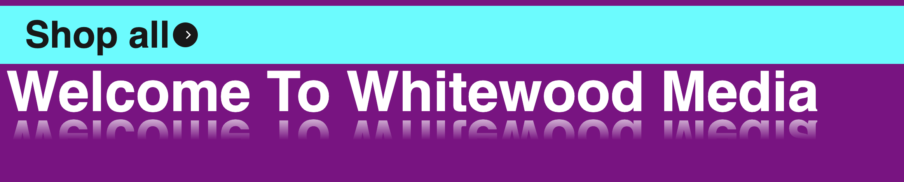

# cool-stuff

## Items & Files
&nbsp;
&nbsp;

## File 1: Reflected-text.html 
This is a chunk of code with some breif CSS styling to easily make it so you can display any text, ideally a header -- so that it looks like it is reflected.

### Screenshot of Reflected Text 

&nbsp;
&nbsp;
&nbsp;
&nbsp;
&nbsp;

## File 2: Background-animation.html
This code contains a feature to animate the background without using JS. Instead, it uses CSS-based @keyframe animation. I also added a polygon black section to contain the color-changing portion. This file also improved the text styling from File 1 because the new background color required making the text easier to read. I added some text-shadow to do so.  
### Screenshot of Background Animation using CSS

&nbsp;
&nbsp;
&nbsp;
&nbsp;
&nbsp;

## File 3: WIP.html
This is for a collapsable container with a button for me to store some bulk pricing grids within on my collection pages. The styling isn't super great at the moment as this is currently a WIP. There is basic aria labeling for accessibility, a simple Javascript function for listen for clicks and add the labels we want and thats it. Ultimately it is hiddeous. I am not sure I will end up needing this or pursuing it further -- but will know more in a couple days. I am working with my team to potentially use an alternative solution. 
